# Side By Side

## 🧠 Estudo de Caso

O projeto **Side By Side** nasceu com o objetivo de promover impacto social, unindo gerações e resolvendo dois grandes desafios enfrentados por grupos diferentes:

### O Problema

- **Idosos:** Enfrentam dificuldade para realizar tarefas simples do dia a dia, como ir ao mercado, consultas médicas ou simplesmente ter alguém com quem conversar.
- **Jovens:** Estudantes em busca de uma renda extra enfrentam limitações de tempo e oportunidades que se encaixem na sua rotina de estudos.

### A Solução

A proposta da plataforma é **conectar jovens dispostos a ajudar com idosos que precisam de companhia ou auxílio em tarefas básicas**, promovendo uma relação de apoio mútuo e benefícios para ambas as partes.

### Modelo de Negócio

1. **Comissão por serviço:** A cada hora trabalhada, a plataforma retém uma pequena taxa administrativa.
2. **Parcerias com instituições:** Clínicas, hospitais e ONGs podem patrocinar ou divulgar a plataforma, fortalecendo seu impacto social.

A plataforma não é apenas um intermediador de serviços, mas um elo que promove inclusão, empatia e valorização social entre gerações.

## 🛠️ Tecnologias Utilizadas

**Backend:**
* **Node.js:** Ambiente de execução JavaScript.
* **Express.js:** Framework web para Node.js, para construção das APIs RESTful.
* **MySQL2:** Driver para conexão e interação com o banco de dados MySQL.
* **Multer:** Middleware para Node.js para manipulação de `multipart/form-data`, usado no upload de arquivos (fotos de perfil).
* **CORS:** Middleware para habilitar o Cross-Origin Resource Sharing.
* **Path:** Módulo nativo do Node.js para manipulação de caminhos de arquivo.
* **Dotenv:** Módulo para carregar variáveis de ambiente de um arquivo `.env`.
* **WS (WebSocket):** Biblioteca para implementação de comunicação em tempo real (chat).

**Frontend:**
* **HTML5:** Estrutura das páginas web.
* **CSS3:** Estilização e design responsivo da interface do usuário.
* **JavaScript (Vanilla JS):** Lógica interativa do lado do cliente, requisições de API (`fetch`), manipulação dinâmica do DOM, cálculo de idades.

**Banco de Dados:**
* **MySQL:** Sistema de gerenciamento de banco de dados relacional.


## 🚀 Como Rodar o Projeto (Localmente)

Siga estes passos para configurar e executar o projeto em sua máquina local:

### Pré-requisitos

* **Node.js e npm** (ou Yarn) instalados.
* **MySQL Server** instalado e rodando.
* Um cliente MySQL (ex: phpMyAdmin, MySQL Workbench, DBeaver) para gerenciar o banco de dados.

### Configuração do Banco de Dados

1.  **Crie o Banco de Dados:**
    * Acesse seu cliente MySQL.
    * Crie um novo banco de dados chamado `sidedb`.
        ```sql
        CREATE DATABASE sidedb;
        ```
2.  **Importe o Esquema:**
    * Execute o script SQL localizado em `backend/codigo_banco.sql` neste novo banco de dados `sidedb`. Este script criará as tabelas necessárias (`usuario`, `agendamento`, `endereco`, `pagamento`, `contato`, `jovem`, `idoso`, `receber`, `avaliacao`, `mensagens`).

### Configuração do Backend

1.  **Navegue até a pasta `backend` no seu terminal:**
    ```bash
    cd backend
    ```
2.  **Instale as dependências:**
    ```bash
    npm install
    # ou
    # yarn install
    ```
3.  **Crie a pasta de uploads:**
    * Na pasta `backend`, crie uma pasta chamada `uploads`. Esta pasta é onde as imagens enviadas pelos usuários serão armazenadas.
        ```bash
        mkdir uploads
        ```
4.  **Configure as variáveis de ambiente (opcional, mas recomendado):**
    * Crie um arquivo `.env` na pasta `backend` (ao lado de `package.json`).
    * Adicione a porta do servidor WebSocket, se quiser uma diferente da padrão (8080):
        ```
        PORT=8080
        ```
5.  **Inicie o servidor backend:**
    * Navegue até a **raiz da pasta `backend`** no seu terminal (onde estão `package.json` e a pasta `src`).
    * Execute o script principal:
        ```bash
        node src/index.js
        # ou, se você tiver nodemon instalado globalmente (recomendado para desenvolvimento):
        # nodemon src/index.js
        ```
    * Você verá a mensagem `Servidor online http://127.0.0.1:3000` no console.

### Configuração do Frontend

O frontend é composto por arquivos HTML, CSS e JavaScript puros, portanto, não requer um processo de build complexo.

1.  **Abra o Navegador:**
    * Após o backend estar rodando, abra seu navegador web.
    * Navegue até o arquivo `index.html` (ou a página inicial de sua escolha, como `pagina_inicial.html`) que está dentro da pasta `frontend`. Você pode abrir o arquivo diretamente (ex: `file:///caminho/para/SideBySide/frontend/index.html`) ou, para melhor simulação de um ambiente de servidor web e auto-reload durante o desenvolvimento, usar uma extensão como "Live Server" no VS Code, apontando para a pasta `frontend`.

## 🤝 Como Usar a Plataforma

1.  **Cadastro:** Jovens e idosos podem se cadastrar na plataforma, preenchendo seus dados e personalizando seus perfis.
2.  **Exploração:** Jovens podem navegar pelas necessidades dos idosos na plataforma, buscando por companheiros ou tarefas.
3.  **Conexão:** Após encontrar um idoso com necessidades compatíveis, os jovens podem iniciar a comunicação via chat em tempo real.
4.  **Encontro:** Depois de se conhecerem virtualmente, podem agendar um encontro pessoal para alinhar expectativas e iniciar a parceria.

## 📱 Telas da Aplicação (UI/UX)

A seguir, apresentamos uma visão geral das principais telas da aplicação, cobrindo o fluxo de cadastro, autenticação, páginas iniciais e perfis.

**Nota:** Todas as imagens desta seção devem estar localizadas na pasta `img/` na raiz do seu projeto.

### Fluxo de Cadastro e Autenticação

Essas telas guiam o usuário desde o registro até o acesso à plataforma.

* **`cadastro_usuario.png`**
    [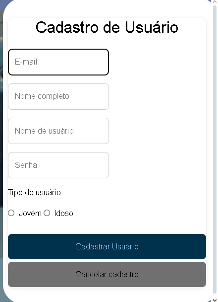](./img/cadastro_usuario.png)
    Interface inicial para novos usuários realizarem seu cadastro na plataforma.

* **`cadastro_usuario_preenchido.png`**
    [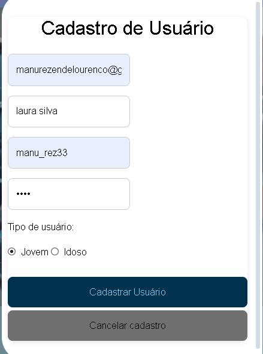](./img/cadastro_usuario_preenchido.png)
    Exemplo da tela de cadastro de usuário com os campos preenchidos, pronta para envio.

* **`logar_usuario.png`**
    [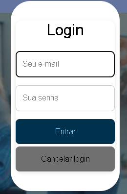](./img/logar_usuario.png)
    Página de autenticação para usuários já cadastrados acessarem suas contas.

* **`cadastro_endereco.png`**
    [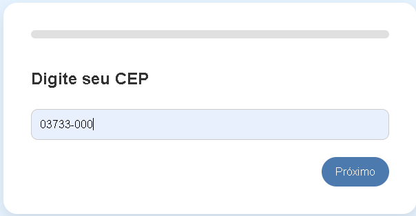](./img/cadastro_endereco.png)
    Formulário dedicado à inserção de informações de endereço do usuário.

* **`cadastro_endereco2.png`**
    [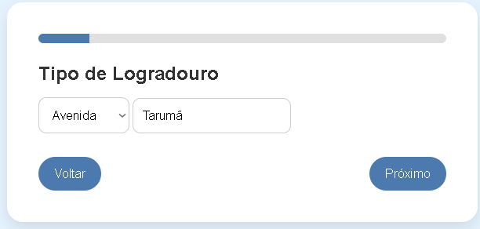](./img/cadastro_endereco2.png)
    (Se for diferente da anterior) Uma segunda etapa ou visualização alternativa do processo de cadastro de endereço.

* **`cadastro_idoso.png`**
    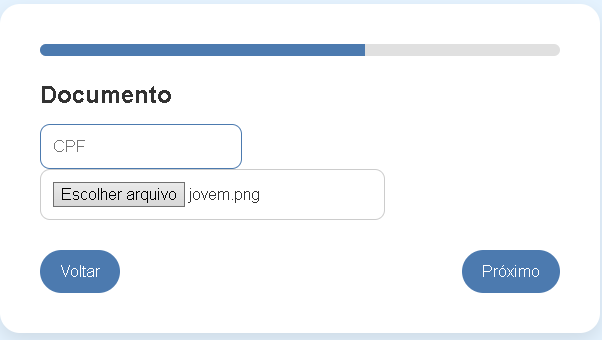
    Formulário específico para o cadastro de perfis de idosos na plataforma.

* **`cadastro_idoso2.png`**
    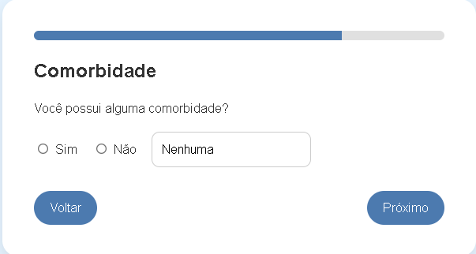
    (Se for uma etapa) Continuação do formulário de cadastro de idosos.

* **`cadastro_idoso3.png`**
    
    (Se for uma etapa) Etapa final ou visualização adicional do formulário de idosos.

### Telas Iniciais e Navegação

Visualizações da página principal da aplicação, mostrando diferentes layouts ou conteúdos.

* **`pagina_inicial.png`**
    [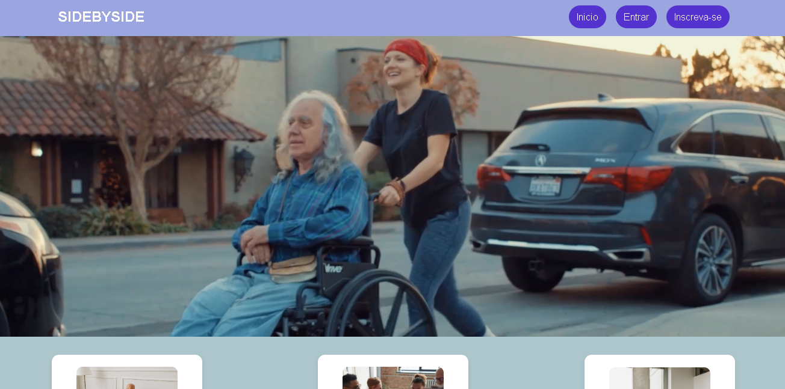](./img/pagina_inicial.png)
    A primeira visualização da aplicação após o login ou acesso inicial.

* **`pagina_inicial2.png`**
    [](./img/pagina_inicial2.png)
    Uma variação ou diferente estado da página inicial.

* **`pagina_inicial3.png`**
    [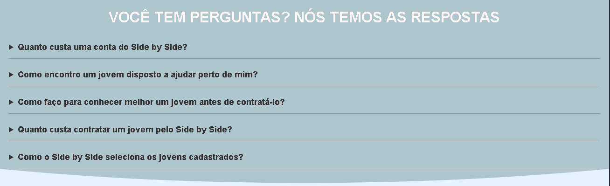](./img/pagina_inicial3.png)
    Outra variação da página principal, possivelmente com diferentes elementos ou destaque.

* **`pagina_inicial4.png`**
    [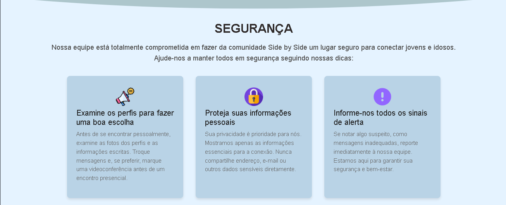](./img/pagina_inicial4.png)
    Mais uma visualização da página inicial, mostrando a evolução do design ou conteúdo.

### Perfil e Listagem

Telas dedicadas à visualização e gestão de perfis.

* **`perfil_idoso.png`**
    [](./img/perfil_idoso.png)
    Página de visualização detalhada do perfil de um idoso, exibindo suas informações e necessidades.

* **`listar_idosos.png`**
    [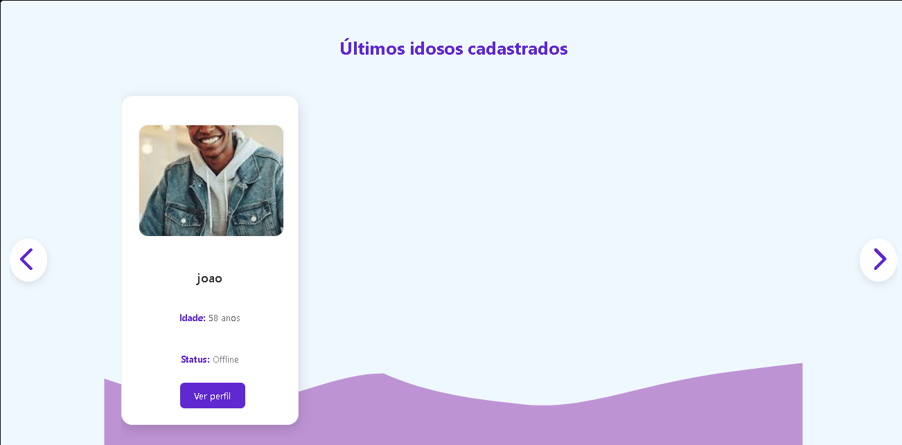](./img/listar_idosos.png)
    Interface que apresenta uma lista ou carrossel de idosos disponíveis para interação.

* **`editar_perfil.png`**
    [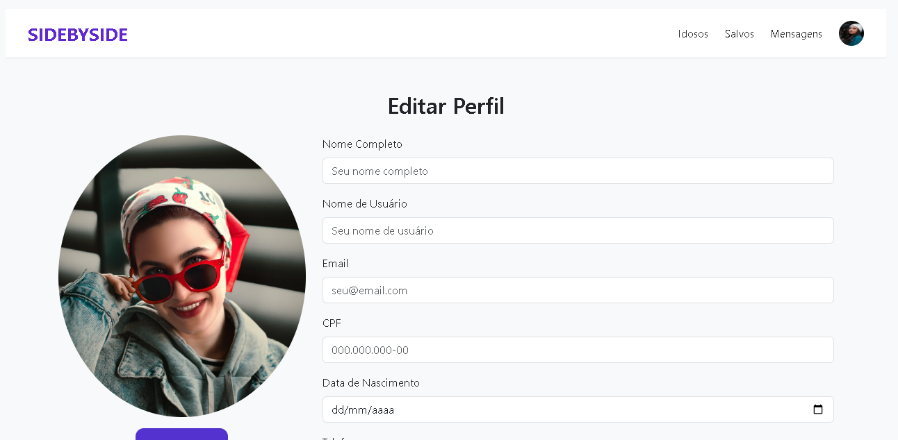](./img/editar_perfil.png)
    Formulário para o usuário realizar alterações em seu próprio perfil cadastrado.

### Outras Telas Úteis

Telas que apoiam funcionalidades específicas da plataforma.

* **`pagina_msg.png`**
    [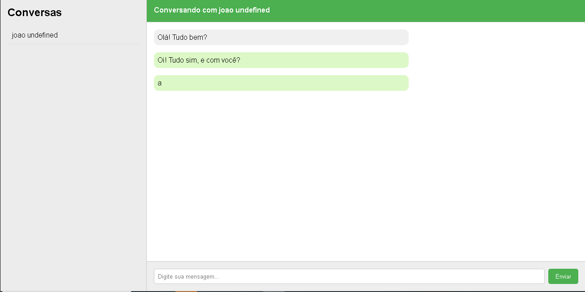](./img/pagina_msg.png)
    Interface de chat ou sistema de mensagens para comunicação entre usuários.

* **`pagina_salvo.png`**
    [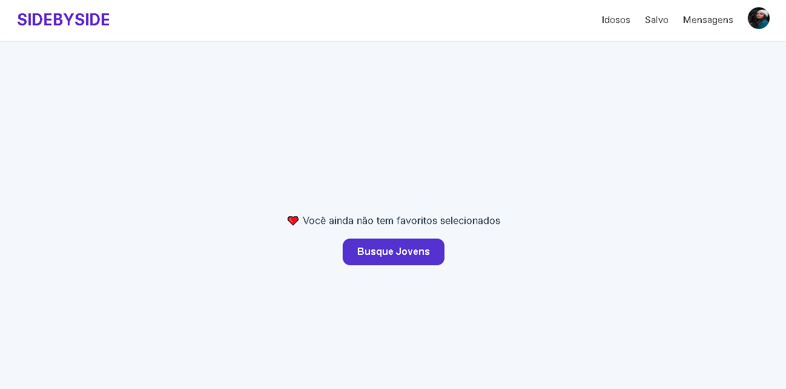](./img/pagina_salvo.png)
    Uma tela de confirmação, geralmente exibida após uma ação bem-sucedida (ex: cadastro, edição).

## 📘 Modelo Conceitual

A imagem abaixo representa o modelo conceitual do banco de dados, mostrando as entidades, atributos e seus relacionamentos principais, abstraindo detalhes de implementação.


## 🔍 Modelo Lógico

O modelo lógico é a evolução do modelo conceitual, com as entidades estruturadas em tabelas, campos, tipos de dados e relacionamentos definidos para implementação no banco de dados, sem considerar o SGBD específico.


## 🔄 Normalizações

Abaixo estão as etapas de normalização do banco de dados, aplicadas para garantir integridade, evitar redundância e melhorar a organização dos dados, seguindo as Formas Normais.

### 🔹 Normalização 1 (1FN)


### 🔹 Normalização 2 (2FN)


### 🔹 Normalização 3 (3FN)


### 🔹 Normalização 4 (4FN)


## 🧱 Modelo Físico (SQL)

Abaixo está o script SQL com a criação completa das tabelas e relacionamentos. Esse código pode ser executado diretamente em um SGBD como MySQL para configurar o banco de dados.

```sql
CREATE DATABASE sidedb;
USE sidedb;

CREATE TABLE usuario (
    id_usuario INT AUTO_INCREMENT PRIMARY KEY,
    tipo_usuario BOOLEAN NOT NULL,
    nome_usuario VARCHAR(25) NOT NULL,
    senha VARCHAR(15) NOT NULL,
    foto_usuario VARCHAR(50), -- Coluna para o caminho da foto de perfil do usuário, pode ser nula
    email VARCHAR(50) NOT NULL UNIQUE,
    nome_completo VARCHAR(100) NOT NULL
);

CREATE TABLE agendamento (
    id_agendamento INT AUTO_INCREMENT PRIMARY KEY,
    id_jovem INT NOT NULL,
    id_idoso INT NOT NULL,
    data_hora DATETIME NOT NULL,
    duracao INT NOT NULL, -- Duração em minutos ou horas
    valor DECIMAL(10,2), -- Valor total do agendamento
    confirmar_idoso BOOLEAN NOT NULL DEFAULT FALSE, -- Confirmação do idoso
    confirmar_jovem BOOLEAN NOT NULL DEFAULT FALSE -- Confirmação do jovem
);

CREATE TABLE endereco (
    id_endereco INT AUTO_INCREMENT PRIMARY KEY,
    logradouro ENUM('Rua', 'Avenida', 'Alameda', 'Travessa', 'Praça', 'Estrada', 'Rodovia', 'Viela') NOT NULL,
    logradouro_nome VARCHAR(50) NOT NULL,
    numero VARCHAR(10) NOT NULL,
    complemento VARCHAR(20),
    cidade VARCHAR(30) NOT NULL,
    estado VARCHAR(20) NOT NULL,
    bairro VARCHAR(30) NOT NULL,
    cep VARCHAR(9) NOT NULL,
    pais VARCHAR(20) NOT NULL DEFAULT 'Brasil'
);

CREATE TABLE pagamento (
    id_pagamento INT AUTO_INCREMENT PRIMARY KEY,
    id_agendamento INT NOT NULL,
    status VARCHAR(20) NOT NULL -- Ex: 'Pendente', 'Concluido', 'Cancelado', 'Falhou'
);

CREATE TABLE contato (
    id_contato INT AUTO_INCREMENT PRIMARY KEY,
    telefone_celular VARCHAR(15) NOT NULL,
    telefone_fixo VARCHAR(15),
    email VARCHAR(50) NOT NULL UNIQUE
);

CREATE TABLE jovem (
    id_jovem INT AUTO_INCREMENT PRIMARY KEY,
    id_usuario INT NOT NULL,
    id_endereco INT NOT NULL,
    id_contato INT NOT NULL,
    cpf VARCHAR(14) UNIQUE NOT NULL,
    data_nascimento DATE NOT NULL,
    experiencia TEXT,
    chave_pix VARCHAR(50),
    descricao VARCHAR(150) NOT NULL,
    genero VARCHAR(15) NOT NULL, -- 'Masculino', 'Feminino', 'Não Binário', etc.
    foto_jovem VARCHAR(50), -- Caminho da foto do jovem
    valor_jovem DECIMAL(10,2), -- Taxa horária do jovem
    assinante_jovem BOOLEAN DEFAULT FALSE -- Indica se o jovem é assinante premium, etc.
);

CREATE TABLE idoso (
    id_idoso INT AUTO_INCREMENT PRIMARY KEY,
    id_usuario INT NOT NULL,
    id_endereco INT NOT NULL,
    id_contato INT NOT NULL,
    cpf VARCHAR(14) UNIQUE NOT NULL,
    data_nascimento DATE NOT NULL,
    comorbidade BOOLEAN NOT NULL DEFAULT FALSE, -- Indica se possui comorbidades
    tipo_comorbidade VARCHAR(50), -- Descrição do tipo de comorbidade
    descricao VARCHAR(150) NOT NULL,
    genero VARCHAR(15) NOT NULL, -- 'Masculino', 'Feminino', 'Não Binário', etc.
    foto_idoso VARCHAR(50), -- Caminho da foto do idoso
    assinante_idoso BOOLEAN DEFAULT FALSE -- Indica se o idoso é assinante premium, etc.
);

CREATE TABLE receber (
    id_receber INT AUTO_INCREMENT PRIMARY KEY,
    id_agendamento INT NOT NULL,
    status VARCHAR(20) NOT NULL, -- Ex: 'Pendente', 'Pago', 'Estornado'
    trabalho_realizado BOOLEAN NOT NULL -- Confirmação do trabalho realizado
);

CREATE TABLE avaliacao (
    id_avaliacao INT AUTO_INCREMENT PRIMARY KEY,
    id_agendamento INT, -- Pode ser NULL se a avaliação não for vinculada a um agendamento específico (ex: geral)
    nota DECIMAL(3,2) NOT NULL, -- Ex: 4.50
    avaliacao VARCHAR(150) NOT NULL -- Comentário da avaliação
);

CREATE TABLE mensagens (
    id_mensagem INT AUTO_INCREMENT PRIMARY KEY,
    id_de INT NOT NULL, -- ID do usuário remetente
    id_para INT NOT NULL, -- ID do usuário destinatário
    conteudo TEXT NOT NULL,
    data_envio DATETIME DEFAULT CURRENT_TIMESTAMP
);


-- Chaves Estrangeiras

ALTER TABLE agendamento ADD CONSTRAINT fk_agendamento_jovem FOREIGN KEY (id_jovem) REFERENCES jovem(id_jovem);
ALTER TABLE agendamento ADD CONSTRAINT fk_agendamento_idoso FOREIGN KEY (id_idoso) REFERENCES idoso(id_idoso);

ALTER TABLE pagamento ADD CONSTRAINT fk_pagamento_agendamento FOREIGN KEY (id_agendamento) REFERENCES agendamento(id_agendamento);

-- Jovem
ALTER TABLE jovem ADD CONSTRAINT fk_jovem_usuario FOREIGN KEY (id_usuario) REFERENCES usuario(id_usuario);
ALTER TABLE jovem ADD CONSTRAINT fk_jovem_contato FOREIGN KEY (id_contato) REFERENCES contato(id_contato);
ALTER TABLE jovem ADD CONSTRAINT fk_jovem_endereco FOREIGN KEY (id_endereco) REFERENCES endereco(id_endereco);

-- Idoso
ALTER TABLE idoso ADD CONSTRAINT fk_idoso_usuario FOREIGN KEY (id_usuario) REFERENCES usuario(id_usuario);
ALTER TABLE idoso ADD CONSTRAINT fk_idoso_endereco FOREIGN KEY (id_endereco) REFERENCES endereco(id_endereco);
ALTER TABLE idoso ADD CONSTRAINT fk_idoso_contato FOREIGN KEY (id_contato) REFERENCES contato(id_contato);

ALTER TABLE receber ADD CONSTRAINT fk_receber_agendamento FOREIGN KEY (id_agendamento) REFERENCES agendamento(id_agendamento);

ALTER TABLE avaliacao ADD CONSTRAINT fk_avaliacao_agendamento FOREIGN KEY (id_agendamento) REFERENCES agendamento(id_agendamento);

-- Mensagens
ALTER TABLE mensagens ADD CONSTRAINT fk_mensagens_de FOREIGN KEY (id_de) REFERENCES usuario(id_usuario);
ALTER TABLE mensagens ADD CONSTRAINT fk_mensagens_para FOREIGN KEY (id_para) REFERENCES usuario(id_usuario);
🔗 Modelo de Entidade Relacional
O modelo de entidade relacional é a visualização gráfica mais próxima do banco de dados real, com todas as tabelas, campos, chaves primárias e estrangeiras definidas, mostrando as ligações entre as entidades.

✅ Finalização
Este documento reúne todas as etapas da construção do projeto Side By Side, desde a análise do problema e a proposta de valor, passando pela modelagem conceitual, lógica e de normalização do banco de dados, até a implementação física SQL. As tecnologias utilizadas e a estrutura do projeto também foram detalhadas para facilitar a compreensão e a colaboração.

📞 Contato
Seu Nome/GitHub: [SEU NOME OU LINK DO GITHUB AQUI]
Email: [SEU EMAIL AQUI]

---

**Instruções Finais:**

1.  **Copie todo o código acima** e cole-o em um arquivo chamado `README.md` na **raiz** do seu projeto `SideBySide`.
2.  **Substitua os Placeholders:**
    * `[SEU NOME OU LINK DO GITHUB AQUI]` pelo seu nome ou link do seu perfil no GitHub.
    * `[SEU EMAIL AQUI]` pelo seu endereço de e-mail.
3.  **Organize as Imagens:**
    * Crie uma pasta chamada `imagens` na raiz do seu projeto `SideBySide` (onde o `README.md` está).
    * Coloque os arquivos `modelo-conceitual.png`, `modelo-logico.png`, `normalizacao1.png`, `normalizacao2.png`, `normalizacao3.png`, `normalizacao4.png`, `modelo-entidade-relacional.png` dentro desta pasta `imagens`.
    * Para as screenshots das telas da aplicação, crie a pasta `frontend/img/screenshots/` (se ainda não existir) e coloque as imagens como `cadastro_usuario.png`, `logar_usuario.png`, etc., dentro dela.
4.  **Verifique os Caminhos:** Certifique-se de que os caminhos para as imagens no `README.md` correspondem exatamente onde você as colocou. Se você decidir usar um caminho diferente para as screenshots, como `assets/screenshots/`, lembre-se de atualizar todos os caminhos no README.

Pronto! Seu `README.md` está completo e pronto para ser usado.